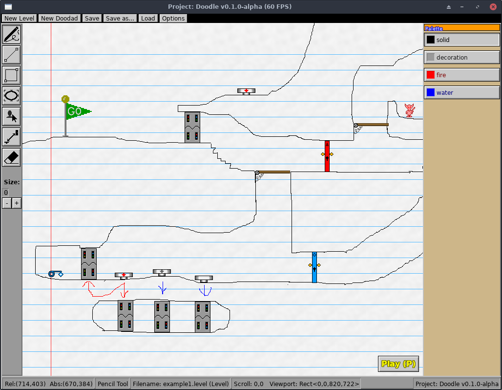
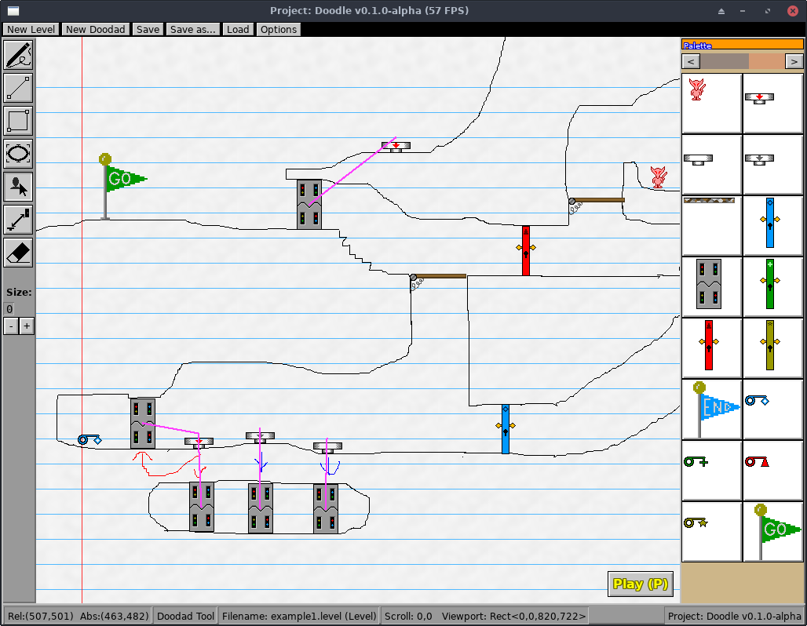

# Creating Custom Levels

One of the core gameplay features is its Level Editor which lets you draw your
own custom maps to play and share with others.

From the game's Main Menu, click on the "Create a Level" button to open the
level editor. To edit an existing custom level, click on the "Edit a Level"
button instead.

## Level Properties

When creating a new level, you first choose some settings for it. These are
described below:

### Page Type

This setting controls the size and boundaries of your level, and control the
appearance of the notebook paper background of your level.

* **Bounded** is the default. The camera won't scroll past the top-left corner
  of the page (0,0), and the level size is capped to 2550x3300, or the
  approximate size of an 11:9 standard sheet of notebook paper in pixels.
* **No Negative Space** is like Bounded, but the width and height of the level
  have no boundary. Levels can grow "infinitely" to the right and downward
  but no negative coordinates past the top or left edge.
* **Unbounded** allows for "infinite" sized maps that give unlimited room to
  grow your level. The wallpaper on this level type only uses the "tiling"
  pattern, so notebook-themed levels won't show the top/left decorations.

### Wallpaper

The wallpaper affects the "theme" of your level. Project: Doodle is themed around
hand-drawn mazes on paper, so the built-in themes look like various kinds of
paper.

* **Notebook** looks like standard ruled notebook paper. It's a white paper with
  blue horizontal lines, a single red vertical line down the left, and a wide
  margin on the top and left edges.
* **Legal Pad** looks like ruled yellow legal pad. It's similar to Notebook but
  has yellow paper and a second vertical red line down the left.
* **Blueprint** is a dark blueprint paper background with a repeating grid pattern.
  Notably, the default Color Palette for this theme is different than normal:
  "solid" lines are white instead of black, to show up better against the dark
  background.

The decorations of the wallpaper vary based on the Page Type. For example, the
Notebook and Legal Pad have extra padding on the top of the page and red lines
going down just the left side, and the rest of the level uses the repeating blue
lines pattern. The page types and their effect on the wallpapers are:

* **Bounded** and **No Negative Space** will show the decorations for the top
  and left edges of the page, as these levels are bounded on their top/left
  corner.
* **Unbounded** levels only use the repeating tiled pattern across the entire
  level, because there is no top-left boundary to anchor those decorations to.

## Editor Mode Interface

Quick 5-minute tour of what you're looking at:

* The top of the window has your **Menu Bar**:
    * **New Level** opens the "Create a New Level" menu.
    * **New Doodad** opens the Doodad Editor for drawing a new custom doodad.
      You're prompted for the size of the doodad, which will be its width and
      height boundary. For example, a size of "100" means a 100x100 pixel graphic
      for your custom doodad.
    * **Save** and **Save as...** let you save the current Level or Doodad you're
      drawing to disk. "Save" will only ask for the filename once whereas "Save as"
      asks every time.
    * **Load** opens the "Edit a Level" menu to choose a Level or Doodad to edit.
    * **Options** options the Level Options dialog so you can modify the page type
      and wallpaper setting.
* The panel on the left side of the window is your **Tool Box**. Clicking these
  buttons activates a specific drawing tool or mode:
    * **Pencil Tool** lets you click, drag, and draw pixels of your selected
      Palette color onto your level freehand.
    * **Line Tool** lets you easily draw a straight line between two points. Click
      in your level where you want the first point to be, and drag your mouse to
      the second point. Release the mouse to commit the line to your drawing.
    * **Rectangle Tool** lets you easily draw rectangles on your level.
    * **Ellipse Tool** lets you draw circles or elliptical shapes.
    * **Doodad Tool** lets you drag doodads such as buttons and doors onto your
      level. See the [Doodad Tool](#doodad-tool) below.
    * **Link Tool** lets you link doodads together so that they can interact off
      each other. For example, a Button connected to an Electric Door will cause
      the door to open and close when the button is pressed. See [Link Tool](#link-tool)
      below.
    * **Eraser Tool** cleans up your mistakes. Click and drag over pixels you've
      drawn to delete the pixels from your level.
    * **Brush Size:** the "Size:" label shows the brush size of your current drawing
      tool. This translates to the line thickness, or how big your pixels are when
      drawn into the level. Click the + and - buttons to increase or decrease the
      brush size, and draw thicker or thinner lines.
* The panel on the right side of the window is your **Palette** of colors to
  draw with.

