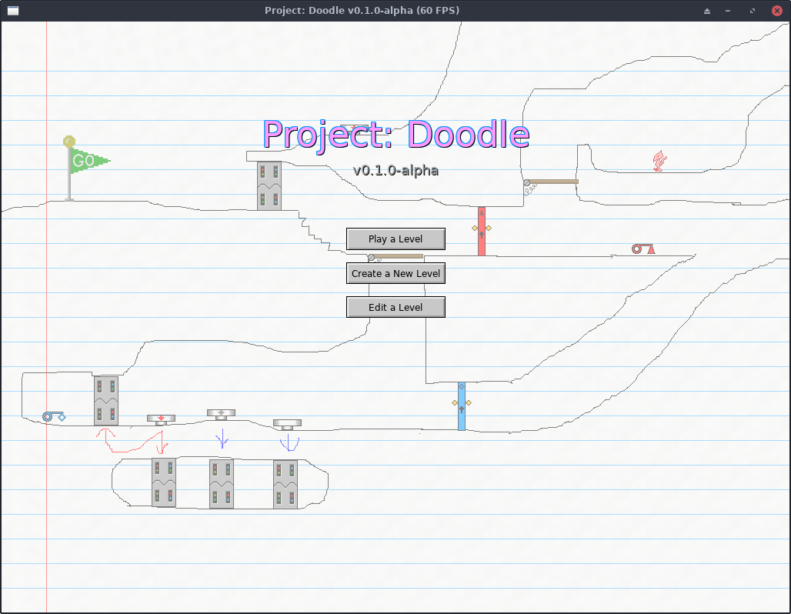

# Welcome to Project: Doodle

[Project: Doodle](about.md) is a drawing-based maze game themed around hand-drawn
maps on paper. You can draw a level for a 2D platformer game, drag-and-drop
"doodads" such as buttons and doors into your level, and play it.

## Table of Contents

* [Creating Custom Levels](custom-levels/)
* [Creating Custom Doodads](custom-doodads/)
    * [Draw Sprites In-Game](custom-doodads/edit-in-game.md)
    * [Draw Sprites with an External Program](custom-doodads/edit-external.md)
    * [Program Them with JavaScript](custom-doodads/scripts.md)
